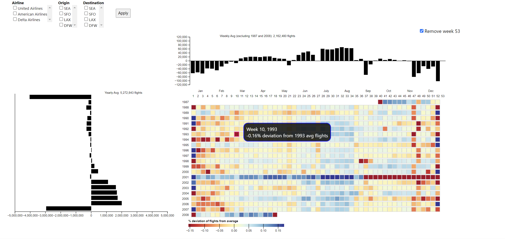
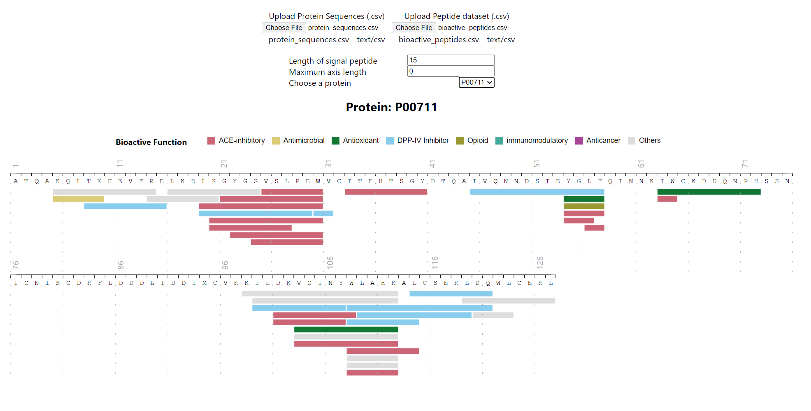
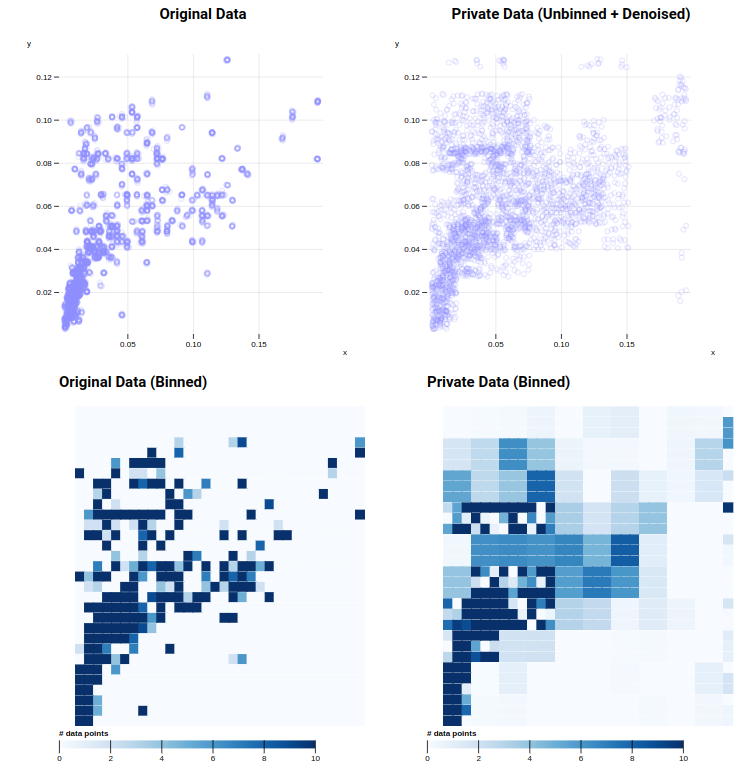
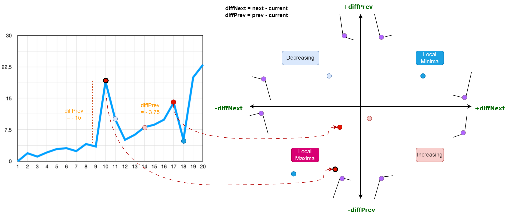

### Hi there 👋

Welcome to my GitHub! I'm a data visualization researcher at Aarhus University, Denmark.

I host all my research on GitHub, and I've featured a few of them below. If you're interested in data analytics with visualization, do check them out 😊

<a href="https://github.com/harith1996/data-viz-au-2021" target="blank">

 
 Weekly flight numbers in USA 

</a>
 
<a href="https://github.com/harith1996/peptide_bioactive_viz" target="blank">

 Peptide stack visualization 

</a>
 

<a href="https://github.com/harith1996/dp-utility-scagnostics" target="blank">

 Measuring utility of differential privacy

</a>
<a href="https://github.com/harith1996/lane-plot" target="blank">

 Measuring utility of differential privacy

</a>
 

 

-   🔭 I’m currently working on visualizing data errors (missing values, duplicate entries etc.)
-   🌱 I’m currently learning Go, for faster real-time data processing
-   ⚙️ I use daily: TypeScript, React, D3.js, Python,
-   📫 How to reach me: harith.rathish@gmail.com or message me on [LinkedIn](https://www.linkedin.com/in/harith-rathish-912092119/)
-   ⚡ Fun fact: ...
